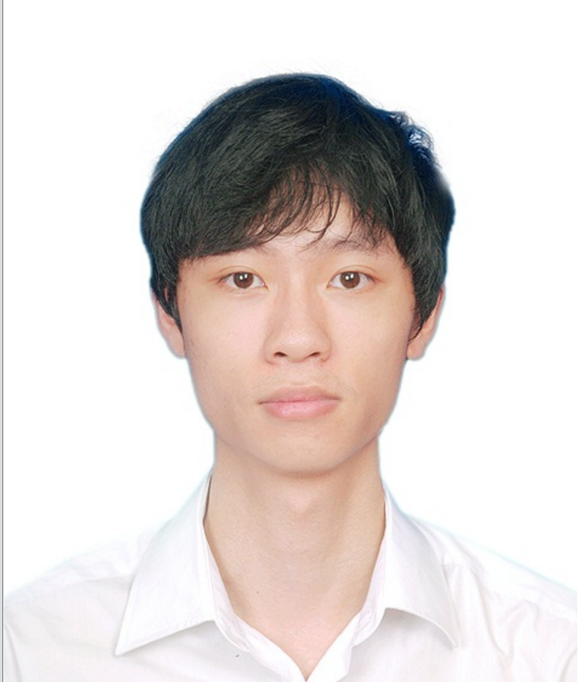
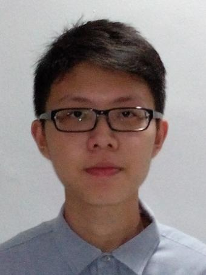
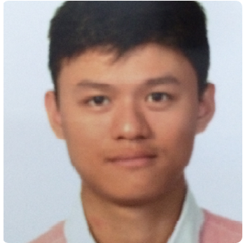

# About Us

We are a team based in the [School of Computing, National University of Singapore](http://www.comp.nus.edu.sg).

## Project Team

#### [MY DUYHOANG LONG](https://github.com/myduyhoanglong)  
 
**Role**: Testing, Team Lead  
**Responsibilities**: UI, Model
* Feature implemented:
   * [Add Command](https://github.com/CS2103JAN2017-T09-B3/main/blob/master/docs/UserGuide.md#add-task--add): support floating task, deadline task, planning task, event
   * [List Command](https://github.com/CS2103JAN2017-T09-B3/main/blob/master/docs/UserGuide.md#list-tasks--list)
* Code written:
   * [functional code](https://github.com/CS2103JAN2017-T09-B3/main/blob/master/collated/main/A0144895N.md)
   * [test code](https://github.com/CS2103JAN2017-T09-B3/main/blob/master/collated/test/A0144895N.md)
* Other major contributions:
   * GUI: include tab list to show all tasks, today tasks and completed tasks.
   * Help other team member fix bugs
-----

#### [IVAN KOH](https://github.com/ivankws)
 
**Role**: Code quality  
**Responsibilities**: Documentation, Model
* Features implemented:
    * [Undo AddCommand](https://github.com/CS2103JAN2017-T09-B3/main/blob/master/docs/UserGuide.md#undo--undo)
    * [Undo DeleteCommand](https://github.com/CS2103JAN2017-T09-B3/main/blob/master/docs/UserGuide.md#undo--undo)
    * [Undo EditCommand](https://github.com/CS2103JAN2017-T09-B3/main/blob/master/docs/UserGuide.md#undo--undo)
    * [Undo ClearCommand](https://github.com/CS2103JAN2017-T09-B3/main/blob/master/docs/UserGuide.md#undo--undo)
 * Code written:
    * [functional code](https://github.com/CS2103JAN2017-T09-B3/main/blob/master/collated/main/A0125221Y.md)
    * [test code](https://github.com/CS2103JAN2017-T09-B3/main/blob/master/collated/test/A0125221Y.md)
 * Other major contributions:
   * Administrative tasks
   * Help fix minor bugs

-----

#### [TANG DI FENG](https://github.com/e0011840)
 
**Role**: Integration  
**Responsibilities**: [Storage](https://github.com/CS2103JAN2017-T09-B3/main/blob/master/docs/DeveloperGuide.md#35-storage)
, GUI
* Features Implemented:
    * [Save Command](https://github.com/CS2103JAN2017-T09-B3/main/blob/master/docs/UserGuide.md#save-tasklist--save)
    * [Open Command](https://github.com/CS2103JAN2017-T09-B3/main/blob/master/docs/UserGuide.md#open-tasklist--open)
    * [Delete Command](https://github.com/CS2103JAN2017-T09-B3/main/blob/master/docs/UserGuide.md#delete-task--delete):delete deadline
    * Graphical User Interface: Right Panel of myPotato
* Code written:
    * [functional code](https://github.com/CS2103JAN2017-T09-B3/main/blob/master/collated/main/A0135807A.md)
    * [test code](https://github.com/CS2103JAN2017-T09-B3/main/blob/master/collated/test/A0135807A.md)
* Other major contributions:
    * Administrative tasks(e.g. collate, releases, schedule meetings)
    * Did initial refactoring from persons to tasks
    * Set up Travis, Appveyor, Codacy, Coveralls

-----

#### [ZHANG YAN HAO](https://github.com/vane1992)
 
**Role**: Scheduling and deadlines, Code quality  
**Responsibilities**: Model, Logic
* Features implemented:
    * [mark](https://github.com/CS2103JAN2017-T09-B3/main/blob/master/docs/UserGuide.md#mark-task-as-done--mark): mark a task as completed
    * [unmark](https://github.com/CS2103JAN2017-T09-B3/main/blob/master/docs/UserGuide.md#mark-task-as-undone--unmark): mark a task as uncompleted
* Code written:
    * [functional code](https://github.com/CS2103JAN2017-T09-B3/main/blob/master/collated/main/A0135753A.md)
    * [test code](https://github.com/CS2103JAN2017-T09-B3/main/blob/master/collated/test/A0135753A.md)
* Other major contributions:
    * Added in SampleData

-----

# Contributors

We welcome contributions. See [Contact Us](ContactUs.md) page for more info.

* [Tang Di Feng](https://github.com/e0011840)
* [My Duy Hoang Long](https://github.com/myduyhoanglong)
* [Ivan Koh](https://github.com/ivankws)
* [Zhang Yan Hao](https://github.com/vane1992)
