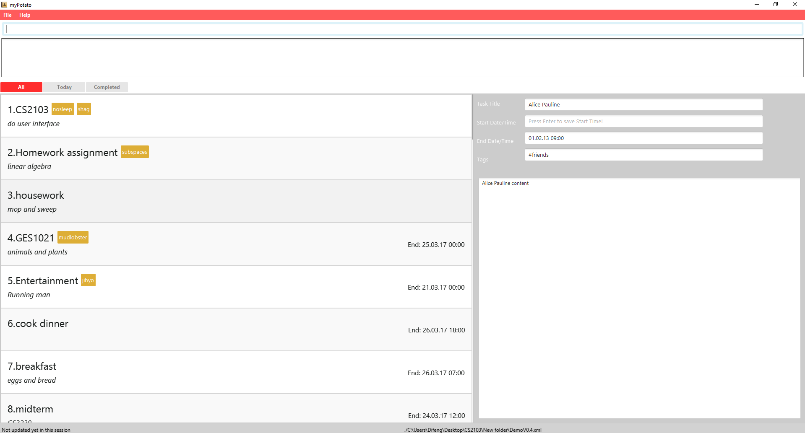

# myPotato - User Guide

By : `Team myPotato`  &nbsp;&nbsp;&nbsp;&nbsp; Since: `FEB 2017`  &nbsp;&nbsp;&nbsp;&nbsp; Licence: `MIT`

---

MyPotato is a user-friendly task scheduler which helps users to better manage their daily tasks. This application allows input and editing of tasks using an easy to use command line interface suitable for users of all technical background. 

1. [Quick Start](#1-quick-start)
2. [Features](#2-features)
3. [FAQ](#3-faq)
4. [Command Summary](#4-command-summary)

## 1. Quick Start

1. Ensure you have Java version `1.8.0_60` or later installed in your Computer. 
2. Download and install the latest version of myPotato.
3. Double-click the icon to start myPotato. The GUI should appear in a few seconds.
   > 
4. Type the command in the command line and press <kbd>Enter</kbd> to execute it.  
   e.g. typing **`help`** and pressing <kbd>Enter</kbd> will open the help window.
5. Refer to the [Features](#2-features) section below for details of each command. 

### Getting Started

In this guide, we will guide you through all the features by the following list.

      1.   Help
      2.   Add a task
      3.   List all tasks
      4.   Select a task
      5.   Edit a task
      6.   Find a task
      7.   Delete a task
      8.   Clear all tasks
      9.   Undo a previous command
      10.  Save task list
      11.  Open task list
      12.  Exit program

#### Launch

You can start the day by opening MyPotato to view the tasks to be completed for the current day. 

Note: Mypotato can help you to automatically sort your tasks according to their deadlines. The earliest deadline will appear at the top of the list and floating tasks at the bottom.

## 2. Features

> **Command Format**
>
> * Words in `UPPER_CASE` are the parameters.
> * Items in `SQUARE_BRACKETS` are optional.
> * Items with `...` after them can have multiple instances.
> * Parameters can be in any order.

#### Viewing help : `help`

After Launching the application, if you need a cheatsheet of the command formats, MyPotato has a help function that displays the list of the commands. Simply enter “help” command for more information.

Format: `help`

> Help is also shown if you enter an incorrect command e.g. `abcd`

#### Adding a task: `add`
You can add a task with or without deadline. Upon adding a task, there will be a feedback message stating that the task is successfully added and the content of the task will be displayed for your verification.  

Format: `add TITLE d/[CONTENT] from/[DATE] [TIME] to/[DATE] [TIME] #[tags]` 
Format: `add TITLE d/[CONTENT] by/[DATE] [TIME] #[tags]`

##### TITLE is the name of a task

##### DATE can be in different formats 
               
      dd/MM/yyyy (e.g 15/3/2017)
      dd/MM/yy (e.g 15/3/17)
      dd/MM: year will be specified as current year (e.g 15/3)
      dd-MM-yyyy (e.g 15-3-2017)
      dd-MM-yy (e.g 15-3-17)
      dd-MM: year will be specified as current year (e.g 15-3)
      dd MMM: year will be specified as current year (e.g 15 Mar)

##### DATE can be in different formats 
      
      HH:mm (e.g 12:15)
      HH :mm am/pm (e.g 9:15pm)
      HH am/pm (e.g 10am)
    

Examples:

* `add Meeting c/rehearse OP2 start/1pm end/4pm 22 Mar #CS2101`

#### Listing all tasks : `list`

After adding the tasks you need, you can track them using the list command. 

Format: `list`

#### Selecting a task : `select`

When you need the contents to a specific task, you can use the select command to choose the task from the list.  

Format: `select INDEX`

> Alternative: click to the task in the showing list

> Select the task and display all details at the specified `INDEX`. 
> The index refers to the index number shown in the most recent listing. 

Examples:

* `list` 
  `select 2` 
  Selects the `2nd task`.
* `find Project`  
  `select 1` 
  Selects the `1st task` from the results returned from the `find` command.

#### Editing a task: `edit`

You can update any part of a task using edit command. The formats of DATE and TIME are the same as add command  

Format: `Edit INDEX [NEW_TITLE] c/[NEW_CONTENT] start/[NEW_TIME] [NEW_DATE] end/[NEW_TIME] [NEW_DATE] #[NEW_TAGS]` 

###### Edits the task at the specified INDEX. The index refers to the index number shown in the last task listing. Existing values will be updated to the input values. When editing tags, the existing tags of the person will be removed i.e adding of tags is not cumulative. You can remove all the task's tags by typing t/ without specifying any tags after it.

Examples:
*  edit 1  d/22/03 
   Edits the due date of the 1st task to be 22/03.
*  edit 2 Project meeting t/LT1 
   Edits the 2nd task to Project meeting and add hashtag LT1.

#### Finding all tasks containing any keyword in their title or due dates: `find`

In addition, you can simply find a specific task by entering the find command accompanied with the task name of due date in the following 
format: `find KEYWORD [MORE_KEYWORDS]`  

###### The keyword is case sensitive.  
e.g `project` will not match `Project` 
###### The order of the keywords does not matter.  
e.g. `Meeting Project` will match `Project Meeting` 
###### Search can based on task name, date or tags. 
###### Only complete word will be matched   
e.g. `Project` will not match `Projects` 
###### Tasks matching at least one keyword will be returned (i.e. `OR` search). 
e.g. `Project` will match `Project Meeting`

Examples:

* `find Meeting` 
  Returns `Project Meeting`
* `find 23/03` 
  Returns Any task due by `23/03`.

#### Deleting a task : `delete`

To use the delete command, the input should be in the following format: `delete INDEX`

> Alternative: choose the task showing in the list. Type delete

###### Task index can be found in the panel List on the left side of myPotato. Input the corresponding index number to delete the targeted task. If there is any deadline you need to remove from a task, simply key in “deadline” after the index.

Examples:

* `list` 
  `delete 2` 
  Deletes the 2nd task.
* `find Project` 
  `delete 1` 
  Deletes the 1st task from the results of the `find` command.
  
#### Clearing all tasks : `clear`

To use the clear command, the input should be in the following format: `clear`

###### This command allows you to clear your tasks when you do not need them anymore.

#### Undoing a previous command: `undo` 

To use the undo command, the input should be in the following format: `undo`

###### This command will undo the previous add/delete command which you had entered. Unless you exit the program, you should be able to undo all the previous add/delete command executed in the program.  

#### Saving the data : `save`

To save the current task list in a specific filepath, the input should be in the following format: `save FILEPATH`

#### Open saved data : `open`

To open a task list from a specific filepath, the input should be in the following format: `open FILEPATH`

#### Exiting the program : `exit`

To use the exit command, the input should be in the following format: `exit`

###### This command will allow you to exit and save your previous changes.

 
## 3. FAQ

**Q**: How do I transfer my data to another Computer? 
**A**: Install the app in the other computer and overwrite the empty data file it creates with
       the file that contains the data of your previous myPotato folder.

## 4. Command Summary

| **Command** | **Format** |
| ----------- | --------------- |
| [Help](#viewing-help-help)| `help` |
| |e.g. ` help` |
| [Add](#adding-a-task-add)| `add t/TASK [d/task] [#tags]` |
| |e.g. ` add t/CS2103 meeting d/03/03 #Programming Lab 2` |
| [Exit](#exiting-the-program-exit)| `exit`|
| |e.g. `exit` |
| [List](#listing-all-tasks-list)| `show a list of task list in the list task` |
| |e.g. `list Homework` |
| [Edit](#editing-a-task-edit)| `edit INDEX [t/TASK] [d/DATE] [#tags]` |
| |e.g. ` edit 1 t/CS2101 meeting d/04/03 #Progress Report` |
| [Find](#finding-all-tasks-containing-any-keyword-in-their-title-or-due-dates-find)| `find KEYWORD [MORE_KEYWORDS]` |
| |e.g. ` find CS2101 meeting` |
| |e.g. ` find #Programming Lab 2` |
| [Delete](#deleting-a-task-delete)| `delete INDEX` |
| |e.g. ` delete 3` |
| [Select](#selecting-a-task-select)| `select INDEX` |
| |e.g.` select 2` |
| [Undo](#undoing-a-previous-command-undo)| `undo`   |
| |e.g. `undo` |
| [Clear](#clearing-all-tasks-clear)| `clear` |
| |e.g. `clear` |
| [Save](#saving-the-data-save)| `save` |
| |e.g. `save` |

